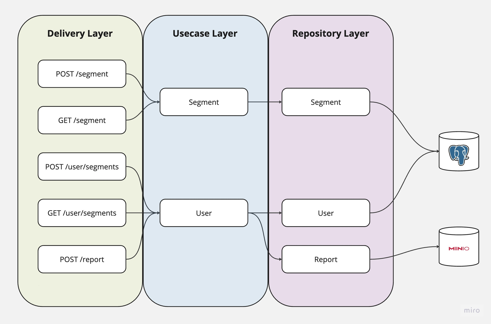
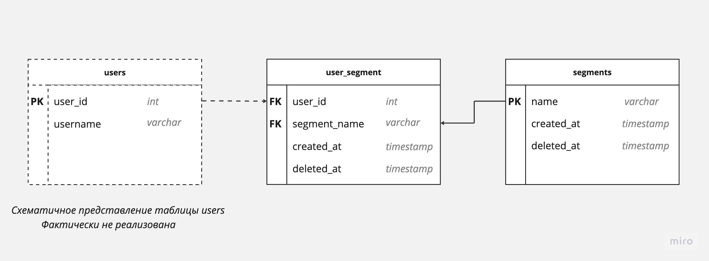

# User Segmentation Service

Сервис, позволяющий проводить динамическое сегментирование пользователей 

## Стек технологий
- Golang 1.21.0

### Технологии и инструменты
- Docker
- HTTP 1.1
- Echo framework
- Swagger
- oapi-codegen  

### Работа с данными
- PostgreSQL
- MinIo  

### Прочие сервисы
- Swagger-UI

## Архитектура приложения


## Схема базы данных Postgres


### Настройка окружения
1) Убедитесь, что у вас установлен docker и docker-compose.
2) Убедитесь, что у вас установлен taskfile.dev. Вы можете установить его, следуя инструкциям на [официальном сайте](https://taskfile.dev/).
3) После установите все необходимые dev-tools с помощью команды:
```bash
task dev-tools:install
```


### Запуск сервисов
1) Поднимите все контейнеры с помощью команды (возможно необходимо вызвать несколько раз):
```bash
task deps
```
2) Swagger-UI расположен на [localhost:3011](http://localhost:3011)

## Сценарии использования API  
### Создание сегмента
```
curl --location '0.0.0.0:8082/segment' \
--header 'Content-Type: application/json' \
--data '{
  "segment_name": "AVITO_VOICE_MESSAGES"
}'
```

### Удаление сегмента
```
curl --location --request DELETE '0.0.0.0:8082/segment?segment_name=AVITO_VOICE_MESSAGES'
```
### Добавление(удаление) сегментов пользователю по его id
```
curl --location '0.0.0.0:8082/user/segments' \
--header 'Content-Type: application/json' \
--data '{
  "user_id": 100,
  "add_segments": [
      {
      "segment_name": "AVITO_DISCOUNT_30"
      }
  ],
  "delete_segments": [
    "AVITO_PERFORMANCE_VAS",
    "AVITO_VOICE_MESSAGES"
  ]
}'
```

### Получение сегментов пользователя по его id 
```
curl --location '0.0.0.0:8082/user/segments?user_id=100'
```

### Получение истории операций пользователя по его id
```
curl --location '0.0.0.0:8082/report' \
--header 'Content-Type: application/json' \
--data '{
  "user_ids": [
    100
  ],
  "from": "2023-08-29",
  "to": "2023-09-01"
}'
```

